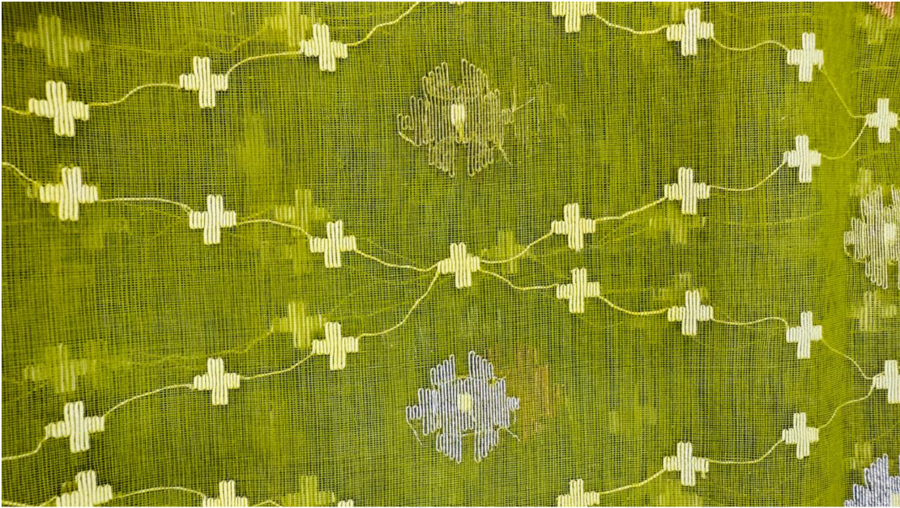
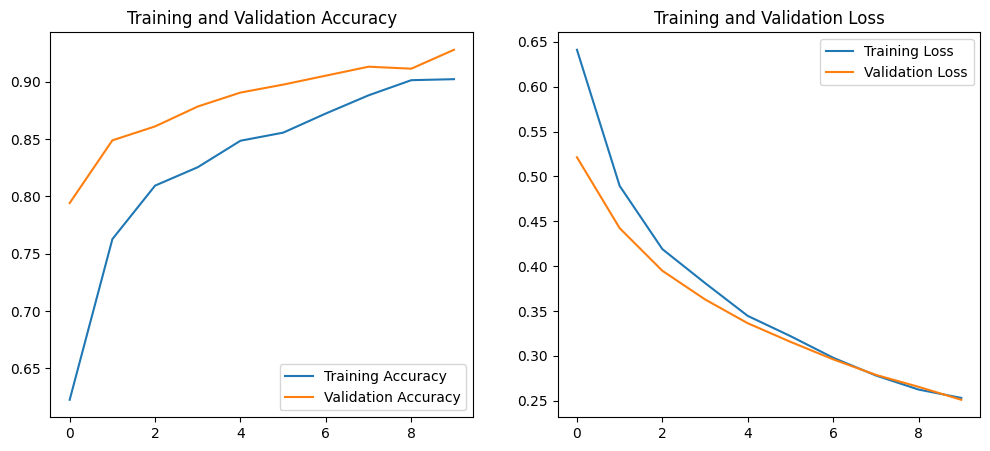

# TEXNET: A Novel Dataset for Handloom Fabric Classification Using Deep Learning

## Project Overview

TEXNET is an ongoing deep learning research project focused on the automated classification of authentic handloom fabrics and powerloom imitations.

---

<!--## System Pipeline

  

--->

## Dataset Samples

  

---

## Proposed Architecture

  

---

## Performance Snapshot

  

> Detailed experimental results will be released after completion of the research.

---

## Technologies

- Python
- TensorFlow / Keras
- OpenCV
- NumPy
- Scikit-Learn
- Matplotlib

---

## Current Status

🚧 Research in Progress

The repository currently serves as a project overview and development tracker. Source code, trained models, and complete dataset details will be released selectively after the completion of ongoing research activities.

---

## Authors

**Md. Talha Mahmud**

**Md. Siam Hossain**
